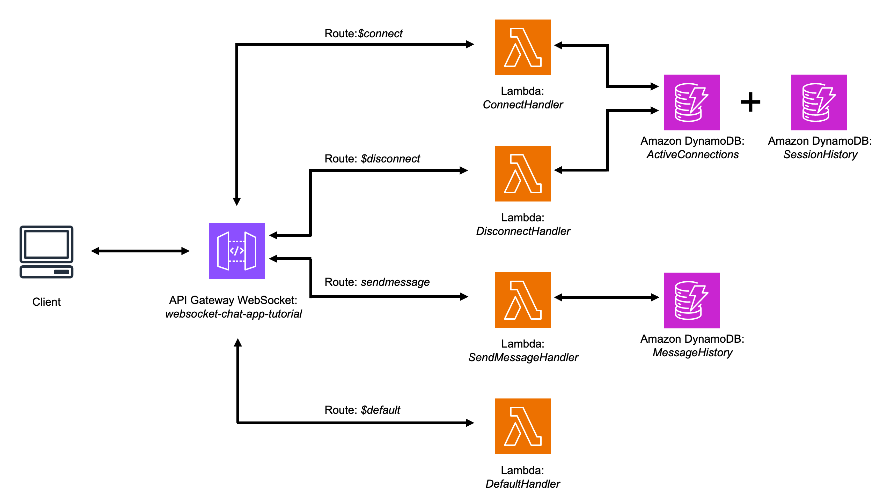

# WebSocket Chat Application with AWS API Gateway & Lambda

This repository provides a **serverless real-time chat application** built with **AWS API Gateway (WebSocket), AWS Lambda, and DynamoDB**. The front-end is a simple **HTML, JavaScript, and CSS-based** interface that enables real-time messaging between clients.

Check this project at GitHub Pages: [https://biagolini.github.io/PythonAwsApiGatewayWebSocket/](https://biagolini.github.io/PythonAwsApiGatewayWebSocket/)

## Project Overview

This project demonstrates:
- **WebSocket API Gateway integration** for real-time communication.
- **AWS Lambda functions** handling connection, disconnection, and messaging events.
- **DynamoDB storage** for active connections, session logs, and message history.
- **A front-end chat client** with login/authentication flow, session tracking, and optional auto-disconnect.
- **JWT-based authentication** integrated into the WebSocket handshake using Lambda Authorizer.
- **Heartbeat messages** to keep WebSocket connections alive.

### Architecture Overview

This project is inspired by the official AWS tutorial and expands its functionality by adding secure access via JWT, improved session tracking, and a login interface. The original architecture can be found [here](https://docs.aws.amazon.com/apigateway/latest/developerguide/websocket-api-chat-app.html).

The architecture includes:

- An **API Gateway WebSocket API** routing events to Lambda functions:
  - **`$connect` Route**: Registers client in DynamoDB and authenticates using a custom Lambda Authorizer.
  - **`$disconnect` Route**: Removes connection from the active list and updates session logs.
  - **`sendmessage` Route**: Broadcasts chat messages and logs them in a message table.
  - **`$default` Route**: Handles unexpected or invalid messages.

- A **Lambda Authorizer** used on the `$connect` route, which validates a **JWT** passed via **query string**, enabling secure authentication even in browser environments.

- A **DynamoDB backend** with:
  - `ActiveConnections` table
  - `SessionHistory` table
  - `MessageHistory` table

- A **static front-end** deployed on GitHub Pages with two main views:
  - **index.html** for login
  - **chat.html** for WebSocket interaction



---

## Repository Structure

```
│
├── index.html                # Login page
├── chat.html                 # Main chat interface
│
├── /styles
│   ├── login.css             # Styles for login
│   └── chat.css              # Styles for chat
│
├── /scripts
│   ├── login.js              # Login logic, JWT handling
│   └── chat.js               # WebSocket connection, messaging, session features
│
├── documentation/
│   ├── lambda_functions/     # Python Lambda functions
│   ├── dynamo_setup.py       # DynamoDB table creation script
│   └── WebSocket_Tutorial.md # Full implementation tutorial
│
└── README.md                 # Project overview
```

---

## Prerequisites

Before using this project, ensure you have:
- An **AWS account** with permissions to use API Gateway, Lambda, and DynamoDB.
- Basic knowledge of **JavaScript, Python, and AWS services**.

---

## Step 1: Clone the Repository

```bash
git clone https://github.com/biagolini/WebSocketChatAWS.git
```

---

## Step 2: Deploy the Backend (WebSocket API & Lambda)

Follow the guide in `documentation/WebSocket_Tutorial.md` to:
1. Create the required DynamoDB tables.
2. Deploy the Lambda functions to handle `$connect`, `$disconnect`, `sendmessage`, and `$default` routes.
3. Set up and deploy the WebSocket API via API Gateway.
4. Attach the Lambda Authorizer to the `$connect` route.
5. Use JWTs passed in query strings for authentication (due to browser WebSocket limitations).

---

## Step 3: Run the Front-End Client

1. Open `index.html` in your browser.
2. Enter the login credentials and obtain a JWT.
3. On successful login, the user is redirected to `chat.html`.
4. The token is appended as a query parameter to the WebSocket URL.
5. Start chatting with other connected users!

### Chat Client Features
- **JWT authentication** via Lambda Authorizer.
- **Session timer** and connection timestamp.
- **Token expiration countdown.**
- **Auto-disconnect feature** for session-limited users.
- **Live message exchange** and logging in DynamoDB.
- **Logout button** to clear session and return to login.

---

## Testing

- Use `wscat` to manually test WebSocket connections:

```bash
wscat -c "wss://your-api-id.execute-api.region.amazonaws.com/dev/?token=Bearer%20<your_jwt>"
```

- Open the [live front-end](https://biagolini.github.io/PythonAwsApiGatewayWebSocket/) in your browser to simulate real-user interaction.

---

## Contributing

Contributions are welcome! Feel free to:
- Report issues or suggest improvements.
- Fork the repository and submit pull requests.
- Enhance the front-end UI or optimize backend functionality.

---

## License

This project is open-source and available under the **MIT License**. You are free to modify and use it, but must adhere to AWS service usage policies.

For the complete implementation and updates, check the [GitHub repository](https://github.com/biagolini/WebSocketChatAWS).
