# Building a Serverless Chat App Using API Gateway WebSocket API and Python Lambda

## Introduction

#### Overview

WebSockets enable a persistent, two-way communication channel between client and server, allowing data to be sent in real-time without polling​ ([Mozilla](https://developer.mozilla.org/en-US/docs/Web/API/WebSockets_API)). AWS API Gateway supports WebSocket APIs that can invoke AWS Lambda functions for managed serverless backend. In this tutorial, we will build a simple chat application using API Gateway (WebSocket) and Lambda, with a static web page using HTML, JavaScript, and CSS. This demonstrates how easily a WebSocket API can be integrated into a lightweight frontend that could even be hosted on static website hosters, like Amazon S3 or GitHub Pages.

This project is **inspired** by an [AWS tutorial](https://docs.aws.amazon.com/apigateway/latest/developerguide/websocket-api-chat-app.html) and extends its functionality to explore additional interactions with WebSocket routes. Enhancements include a chat history, with IP identification of users, multi-table DynamoDB architecture, and refined session tracking.

#### Architecture

The architecture consists of an API Gateway WebSocket endpoint that routes incoming WebSocket requests based on predefined routes. These routes trigger AWS Lambda functions, which handle different aspects of the chat system. The primary routes include:

- **`$connect` Route**: Triggers the `ConnectHandler` Lambda function, which registers the new client connection in the `ActiveConnections` table and logs session details in the `SessionHistory` table.
- **`$disconnect` Route**: Triggers the `DisconnectHandler` Lambda function, which removes the client connection from the `ActiveConnections` table and updates session details in the `SessionHistory` table.
- **`sendmessage` Route**: Triggers the `SendMessageHandler` Lambda function, which processes incoming chat messages and stores them in the `MessageHistory` table.
- **`$default` Route**: Triggers the `DefaultHandler` Lambda function to manage unexpected messages or routes.

Each Lambda function interacts with Amazon DynamoDB for data persistence, ensuring efficient storage and retrieval of connection states, session details, and chat messages. The API Gateway Management API enables broadcasting messages back to connected clients.

The figure below visually represents the architecture.

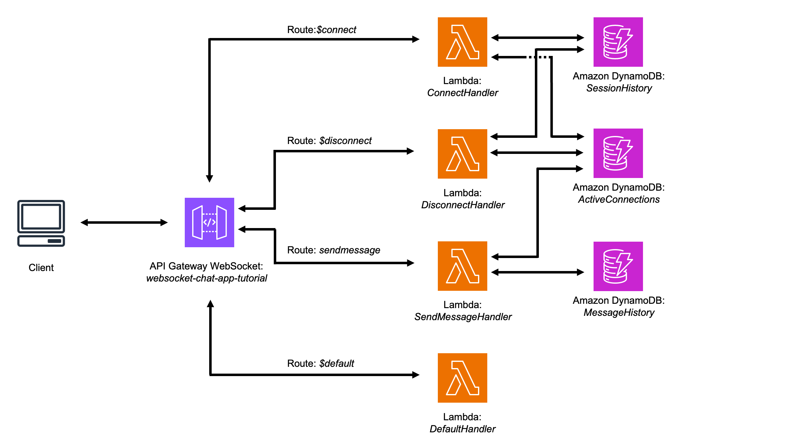

#### DynamoDB Tables 

The following lists the expected fields for each of the DynamoDB tables used in this architecture:

**Active Connections Table (`ActiveConnections`)**:
  - `connection_id`: A randomly generated ID that identifies each connection.

**Session History Table (`SessionHistory`)**:
  - `connection_id`: A randomly generated ID that identifies the connection.
  - `source_ip`: The user's IP address.
  - `connected_at`: The UTC date and time when the user joined.
  - `disconnected_at`: The UTC date and time when the user left.
  - `duration_seconds`: Duration of the session (in seconds).

**Message History Table (`MessageHistory`)**:
  - `message_id`: A randomly generated ID for each message.
  - `connection_id`: The randomly generated ID that identifies the sender's connection.
  - `message`: The actual content of the chat message sent by the user.
  - `timestamp`: The UTC date and time when the message was sent.

## Step-by-step tutorial

#### Step 1: Create DynamoDB Tables

To get started, create three DynamoDB tables using the AWS Console:

**Go to the AWS Management Console** and open the DynamoDB service.

**Create the following tables** with a single primary key (Partition Key):
   - **ActiveConnections**: `connection_id` (String)
   - **SessionHistory**: `connection_id` (String)
   - **MessageHistory**: `message_id` (String)

**Choose the "On-Demand" (serverless) billing mode**, as this is a Proof of Concept (PoC) and we want cost efficiency.

**Finish and save** each table.

If you prefer, you can create the tables programmatically using AWS SDKs. The code to automate this setup is available in the repository: [GitHub](https://github.com/biagolini/PythonAwsApiGatewayWebSocket).

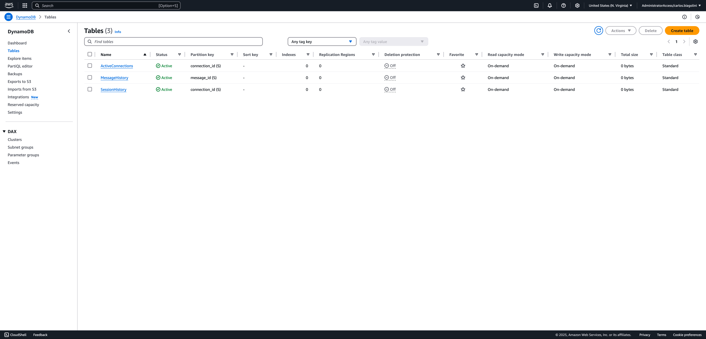

---

#### Step 2: Create Lambda Functions

Create the following Lambda functions with their respective permission levels:

- **`DefaultHandler`**: Requires access to **API Gateway Management API + LambdaBasicExecutionRole**.
- **`ConnectHandler`**: Requires permissions to **write to DynamoDB tables `ActiveConnections` and `SessionHistory` + LambdaBasicExecutionRole**.
- **`DisconnectHandler`**: Requires permissions to **update items in DynamoDB table `SessionHistory` + delete items in DynamoDB table `ActiveConnections` + LambdaBasicExecutionRole**.
- **`SendMessageHandler`**: Requires permissions to **read from `ActiveConnections` + write to DynamoDB tables `MessageHistory`+  post messages via API Gateway Management API + LambdaBasicExecutionRole**.

**Note**: In this tutorial, the default timeout setting was not modified, and the functions worked as expected with a 3-second timeout. However, if you expand or customize the Lambda functions to perform additional tasks, keep in mind that you may need to increase the timeout duration accordingly.

#### DefaultHandler

```python
# Code in folder `lambda_functions`
```

#### ConnectHandler

```python
# Code in folder `lambda_functions`
```

#### DisconnectHandler

```python
# Code in folder `lambda_functions`
```

#### SendMessageHandler

```python
# Code in folder `lambda_functions`
```
---

#### Step 3: Create a WebSocket API in AWS API Gateway

##### Step 3.1 Create the API Gateway WebSocket API

Sign in to the [API Gateway console](https://console.aws.amazon.com/apigateway).

Create a new WebSocket API:
- Click on **Create API**.
- Under **WebSocket API**, select **Build**.

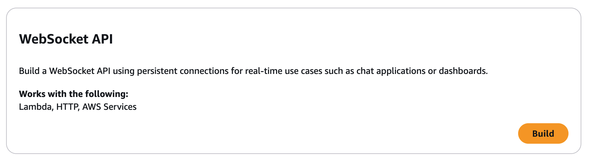

##### Step 3.2 Configure API Settings

Create a new WebSocket API:
- **API name:** Enter `websocket-chat-app-tutorial`.
- **Route selection expression:** Enter `request.body.action`. This expression tells API Gateway how to determine which route to invoke when a client sends a message.

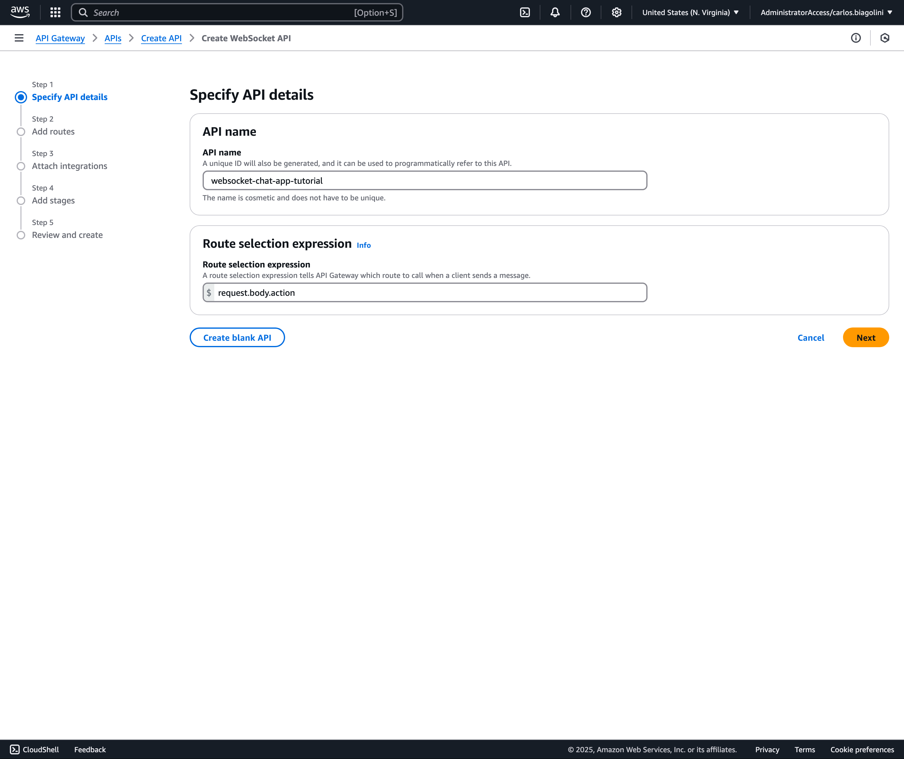

##### Step 3.3 Define WebSocket Routes

In the **Predefined routes** section, add predefined WebSocket routes:
- Click **Add $xxx route** buttons to add AWS predefined routes:
  - `$connect`: Triggered when a client connects.
  - `$disconnect`: Triggered when a client disconnects.
  - `$default`: Used for undefined actions.

In the **Custom Routes** section, add the following custom route:
- `sendmessage`: Handles message sending.

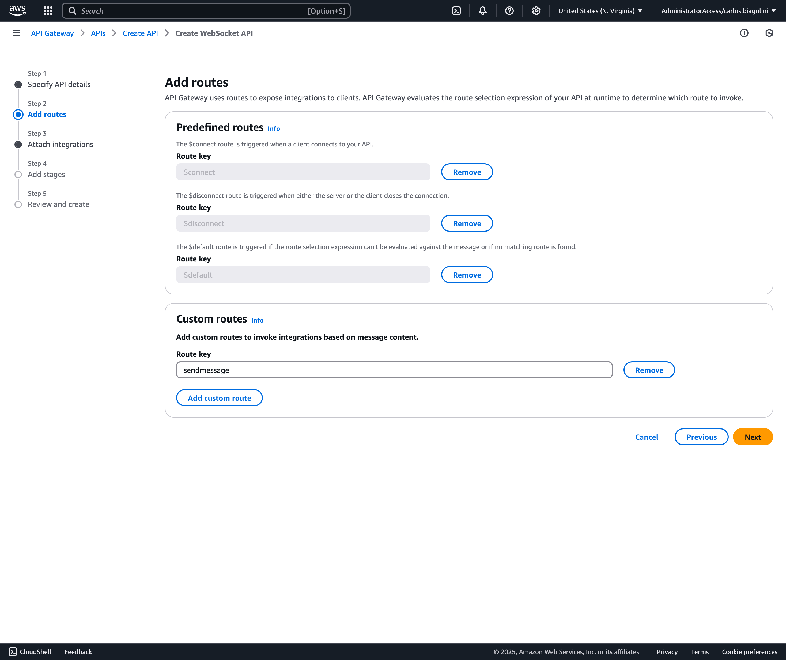

##### Step 3.4 Create Lambda Integrations for WebSocket Routes

Assign Lambda functions to each route and enter the corresponding Lambda function ARN:
- `$connect` → `arn:aws:lambda:us-east-1:123456789012:function:ConnectHandler`
- `$disconnect` → `arn:aws:lambda:us-east-1:123456789012:function:DisconnectHandler`
- `$default` → `arn:aws:lambda:us-east-1:123456789012:function:DefaultHandler`
- `sendmessage` → `arn:aws:lambda:us-east-1:123456789012:function:SendMessageHandler`

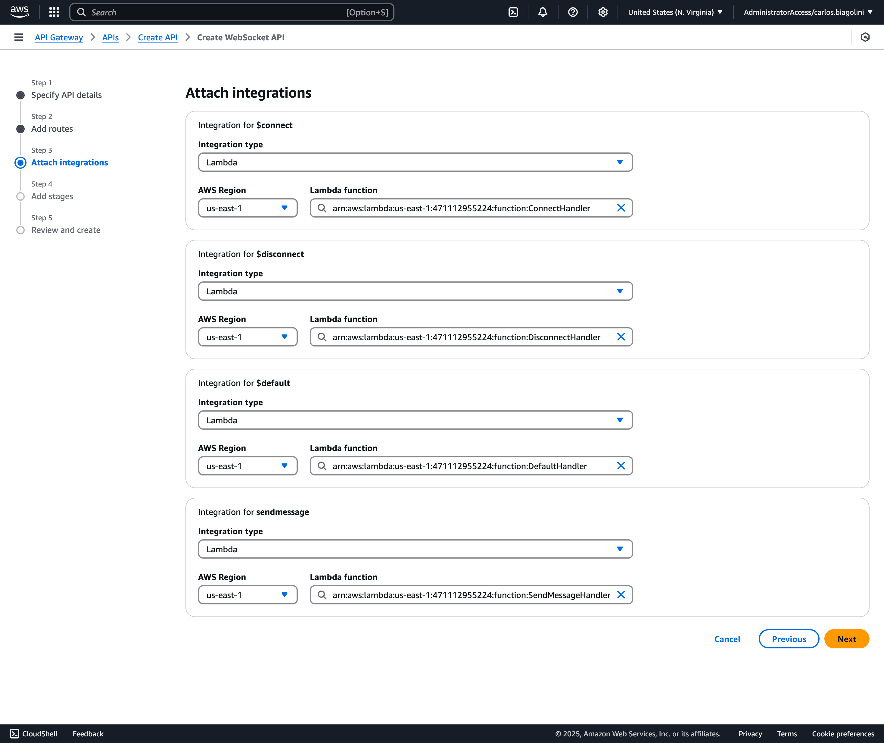

##### Step 3.5 Set Up a Deployment Stage

In the **Stages** section, define a **Stage name**, for instance: `dev`.

Deploy the WebSocket API and wait a few seconds.

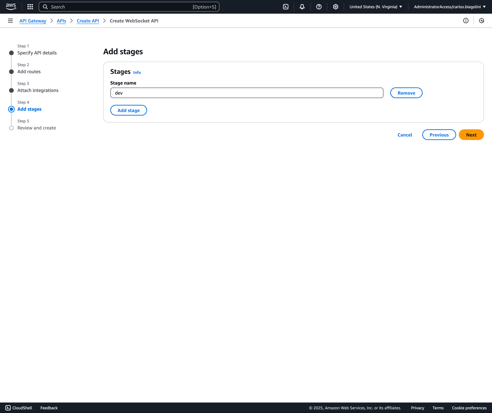

##### Step 3.6 Retrieve the WebSocket URL

In the API Gateway console, click **Stages**. Locate the stage from the previous step (e.g., `dev`).

Copy the **WebSocket URL**. This URL is required for clients to connect to the WebSocket server.

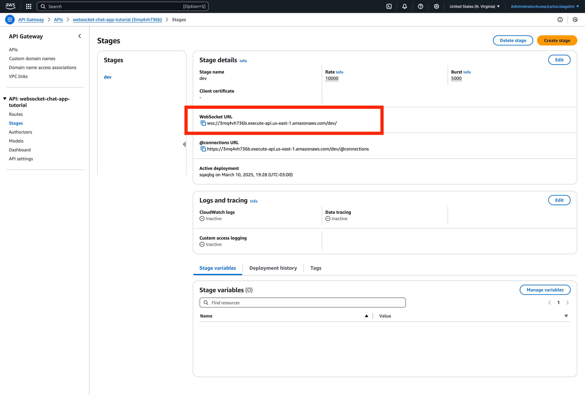

---

## Step 4: Testing the WebSocket Connection in your terminal

##### Step 4.1 Establishing a WebSocket Connection

To test your WebSocket API, you need the `wscat` package, which allows you to connect and send messages through a WebSocket connection. First, check if `wscat` is installed on your system by running:

```bash
wscat --version
```

If the command returns a version number, `wscat` is installed, and you can proceed. Otherwise, ensure you have [Node.js](https://nodejs.org/en) installed, then install `wscat` globally using:

```bash
npm install -g wscat
```

Once `wscat` is installed, open two or more terminal windows. In each terminal, use the following command to connect to your WebSocket API:

```bash
wscat -c wss://xxxxxxx.execute-api.us-east-1.amazonaws.com/dev/
```

Upon a successful connection, API Gateway will invoke the `$connect` route of your WebSocket API. The associated Lambda function will store your connection ID in the `ActiveConnections` table and log session details in the `SessionHistory` table.

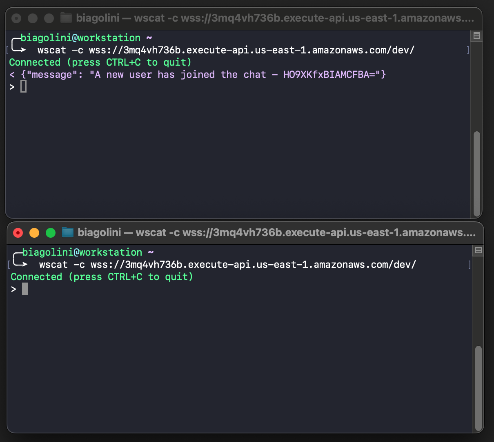


##### Step 4.2 Confirm Message Sending

After establishing the connection, you can proceed with sending and receiving messages as part of testing your WebSocket API.

In one of the open chat terminals, send test messages to verify the WebSocket API is correctly processing and storing messages.

To send a message, use the `wscat` client as follows:

```bash
wscat -c wss://xxxxxxx.execute-api.us-east-1.amazonaws.com/dev/
```

Once connected, send a test message by typing:

```bash
{"action":"sendmessage","message":"Hello, WebSocket!"}
```

This command sends a structured JSON message where:
- `action` is set to `sendmessage`, matching the API Gateway route.
- `message` contains the test message content.

**Verify the Message in DynamoDB:**

Access your **DynamoDB console** and navigate to the `MessageHistory` table to check if the message was recorded successfully.

Ensure that a new entry exists with the following fields:
- `message_id`: A randomly generated ID assigned to the message.
- `connection_id`: The unique identifier of the sender’s connection.
- `message`: The message content, e.g., `Hello, WebSocket!`.
- `timestamp`: The UTC date and time when the message was sent.

If the message is correctly stored, this confirms that your WebSocket API and Lambda functions are processing messages as expected.

##### Step 4.3 Confirm DynamoDB tables

Access your **Amazon DynamoDB** tables and verify that the new connection and message has been recorded correctly:

**Check `ActiveConnections` Table:** Ensure that a new entry exists with the `connection_id` of the connected client.

**Check `SessionHistory` Table:** Ensure that a new entry exists with the `connection_id`, `source_ip`, and `connected_at` timestamp.

**Check `MessageHistory` Table:** Ensure that a new entry exists with the `message_id`, `connection_id`, `message`, and `timestamp` fields.

If all entries have been correctly recorded, your **WebSocket API and Lambda functions** are processing connections and messages as expected.

##### Step 4.4 Disconnect

Press `CTRL+C` to disconnect from your API. When a client disconnects from your API, API Gateway invokes the `$disconnect` route. The Lambda integration for your API's `$disconnect` route:

1. Removes the connection ID from the `ActiveConnections` table.
2. Updates the corresponding entry in the `SessionHistory` table with the `disconnected_at` timestamp and calculates the session duration.

After disconnecting, access your DynamoDB tables again to confirm:

- **`ActiveConnections` Table:** The connection ID should be removed.
- **`SessionHistory` Table:** The corresponding entry should now have `disconnected_at` and `duration_seconds` fields populated.

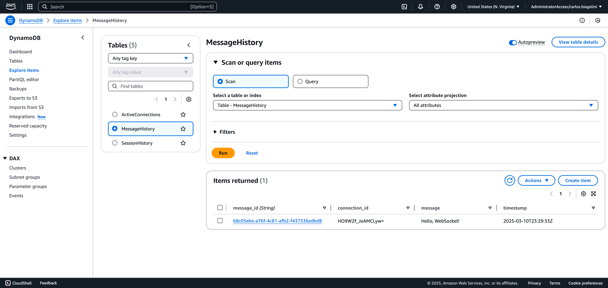

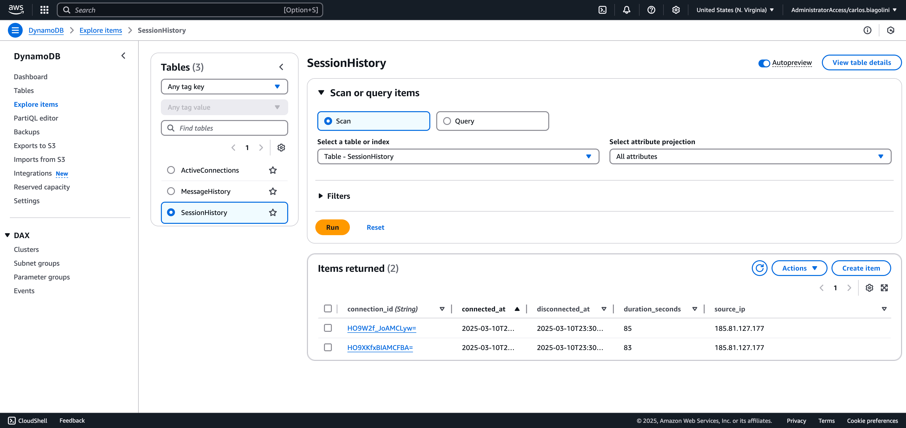

---

## Step 5: Implement a Simple Chat App with HTML, JS, and CSS

In this step, we integrate a simple front-end chat application to interact with our WebSocket API. Since the focus of this tutorial is on setting up the WebSocket API in AWS, I won’t go into detailed explanations of the front-end code. However, you can find the full implementation in the [GitHub repository](https://github.com/biagolini/PythonAwsApiGatewayWebSocket) and test the application directly via GitHub Pages at [this link](https://biagolini.github.io/PythonAwsApiGatewayWebSocket/).

### Overview of the Front-End Functionality

The front-end consists of an HTML, JavaScript, and CSS-based web application that allows users to connect to the WebSocket API, send messages, and receive real-time updates from other participants. Here’s a high-level overview of its key features:

- **User Connection**: Users enter the WebSocket API URL and establish a connection. If a previously used address is stored in local storage, the application automatically reconnects on page reload.
- **Chat Messaging**: Messages sent by users are broadcasted to all active connections with a prefix indicating the sender's connection ID.
- **Session Tracking**: The application displays a user’s connection timestamp (UTC) and a real-time counter indicating how long they’ve been connected.
- **Automatic Reconnection Prevention**: Since AWS API Gateway automatically closes inactive WebSocket connections after a certain time, the application sends periodic heartbeat messages (every 30 seconds) to keep the connection alive.
- **Auto-Disconnect Feature**: Users can enable an auto-disconnect option, setting a predefined session timeout (default is 60 seconds). This feature simulates real-world scenarios where user sessions are limited, such as prepaid usage environments where credits dictate service availability.

For a fully functional implementation, including UI enhancements and additional features, refer to the [GitHub repository](https://github.com/biagolini/PythonAwsApiGatewayWebSocket) and test it via [GitHub Pages](https://biagolini.github.io/PythonAwsApiGatewayWebSocket/).

---

## Conclusion

This tutorial demonstrated how to set up a **WebSocket API** using **AWS API Gateway and Lambda** to enable real-time communication. We built a **serverless chat application** with **session tracking, message broadcasting, and connection management** using **DynamoDB**. 

With AWS’s **scalable and event-driven** capabilities, this setup can be expanded for authentication, user roles, or integration with other AWS services. For the full source code and future enhancements, visit the [GitHub repository](https://github.com/biagolini/PythonAwsApiGatewayWebSocket).

---

## Stay Connected

If you found this guide helpful, stay connected for more insights on **AI, cloud security, and AWS automation**:
- **LinkedIn:** [https://www.linkedin.com/in/biagolini](https://www.linkedin.com/in/biagolini)
- **Medium:** [https://medium.com/@biagolini](https://medium.com/@biagolini)
- **GitHub:** [https://github.com/biagolini](https://github.com/biagolini)

Happy building with **AWS API Gateway WebSocket!** 🚀